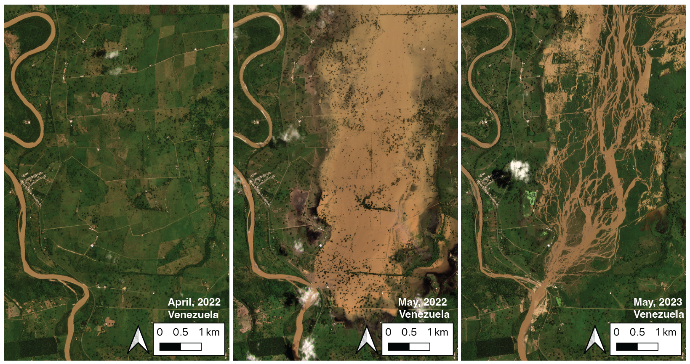

## River Avulsion Research
### Rules of River Avulsion Change Downstream

My latest work involves an overlooked natural hazard: river avulsions. As seen in the figure above, river avulsions occur when a river breaches its banks and begins to shift course on the floodplain. The resulting flooding can be some of the most intense on Earth, as the entire channel destabilizes catastrophically. Recent avulsions in India alone have displaced millions and damaged agricultural and transportation infrastructure.

### Key Findings

I tested two 80-year-old ideas of avulsion initiation by quantifying the topography around avulsing rivers. This work demonstrated that these two mechanisms, historically invoked separately, work together. I further presented a novel theoretical framework that identifies which rivers are vulnerable to avulsion and predicts the path of an avulsing river.

### Technical Innovation

The research leveraged:
- State-of-the-art digital elevation models
- Novel applications of ICESat-2 (space-borne lidar platform)
- BASED (Boost-Assisted Stream Estimator for Depth) model
- Advanced geospatial data engineering pipelines

This novel application of glaciological methods to alluvial floodplain topography allowed me to generate bare-earth cross-sections of active, natural alluvial systems in remote places like the Amazon and Papua New Guinea.

### Impact

This work has significant implications for:
- Flood prediction and mitigation
- Infrastructure planning in river-adjacent areas
- Climate change adaptation strategies
- Understanding fundamental river dynamics

### Related Publications

1. **James H. Gearon**, Harrison Martin, Clarke DeLisle, Eric Barefoot, David Mohrig, Chris Paola, and Douglas Edmonds. *Rules of river avulsion change downstream* [Nature, 2024 (accepted)].

2. T. H. Doane, **J. H. Gearon**, H. K. Martin, B. J. Yanites, and D. A. Edmonds. *Topographic roughness as an emergent property of geomorphic processes and events*. [AGU Advances, 5(5), 2024](https://doi.org/10.1029/2023AV000921).

[Back to Home](/) 