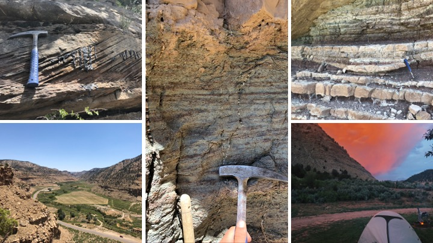

## Portfolio

---

### Sedimentology 
[Facies Character and Morphology of an Eocene Terminal Splay Complex, Uinta Basin, Utah](/Uinta)

**Project description:** Lacustrine deltas call for careful interpretation as they are distinct from their marine
counterparts. Lacustrine delta-fronts are dominated by shallow, low-relief sandy channels which drive sheet-sand
deposition basin-ward. Furthermore, lake base level can change meters over short time scales (100s of years
) leading to high-frequency progradational and retrogradational sequences. The Sunnyside Delta Interval—200m
interval of 10 fluvio-lacustrine sequences (Keighley et al., 2002 & 2003)—of the Middle Green River Fm. has been
thoroughly studied but the nature of the sediment delivery mechanism to Eocene Lake Uinta remains hotly debated in
the literature. Previous workers have classified the interval as a Fluvially-Dominated Delta (Remy, 1991; Schomacker
 et al., 2010), a Fluvial Fan (Wang, 2019), and a Terminal Splay (Pusca Doctoral Thesis, 2003). I believe that the
 Sunnyside Delta Interval most resembles a Terminal Splay Complex (after Fisher et al., 2008) based on facies
 character and morphology.
---
[Project 2 Title](/pdf/sample_presentation.pdf)

---
[Project 3 Title](http://example.com/)

---

### Data Analytics
- [Project 1 Title](http://example.com/)
- [Project 2 Title](http://example.com/)
- [Project 3 Title](http://example.com/)
- [Project 4 Title](http://example.com/)
- [Project 5 Title](http://example.com/)

### Petroleum Geology

### Geomorphology

### Soils

[Desert Ecogeomorphology | Eldorado Valley | Boulder City, NV, USA](/Soils)

### Miscellaneous Projects
---

---

Page template forked from <a href="https://github.com/evanca/quick-portfolio">evanca</a>

<!-- Remove above link if you don't want to attibute -->
